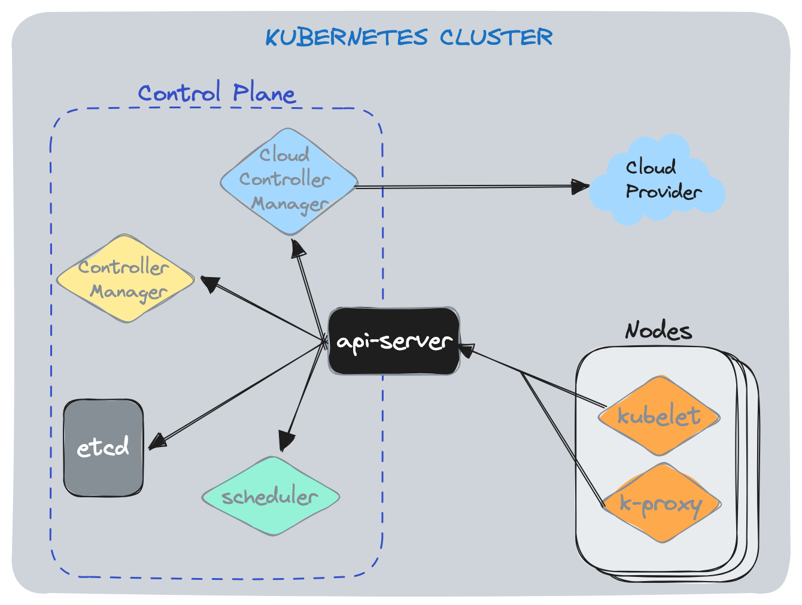
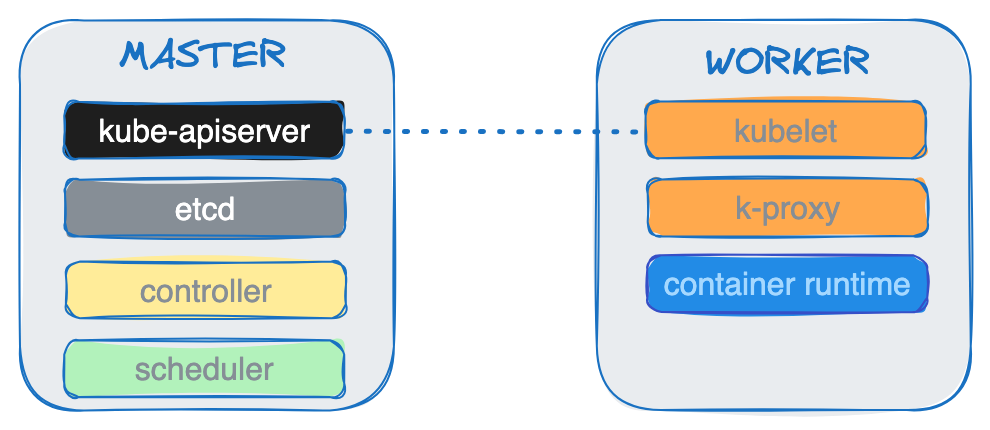

# Kubernetes: Arquitetura

Kubernetes segue uma arquitetura cliente-servidor em que temos o servidor master com vários componentes e os servidores workers que se comunicam com a master para realizar operações. Dentro do servidor Master do cluster ficam os componentes do Control Plane: 

- Kube API Server
- Cloud Controller Manager (Opcional)
- Controller Manager
- Scheduler
- ETCd.

Já nos Nodes do cluster ficam o Kubelet e o Kube-Proxy.



## Componentes do Node Master

**kube-apiserver** é a entidade central que gerencia as requisições REST para modificações (pods, services, replicações, controllers, etc) feitas pelos outros componentes da Master. É o `kube-apiserver` que recebe requisições, por exemplo, do `kubectl`.

**ETCd** é o BD chave-valor distribuído e acessível apenas pelo `kube-apiserver` que guarda os dados do cluster (quantidade de pods, os estados, namespaces, etc).

**Kube-Scheduler** escalona, de acordo com a utilização de hardware/software/policy/affinity/etc, os Pods nas máquinas worker. 

```
💡 Quando um deploy e sua replicaset decidem que uma nova réplica é necessária, um pod é adicionado ao BD do Kubernetes e adicionado à fila do escalonador. O scheduler faz watch dessa fila procurando por Pods não escalonados. Então, pega o próximo Pod e encontra um node onde pode rodar (de acordo com os critérios de recursos). Uma vez que o Pod foi escalonado no node, o `kubelet` que roda naquele node assume e toma conta de inicializar seus containers. Quando você deleta um Pod é o `kubelet` que vê isso e inicia a substituição. O Kubelet sabe que um determinado Pod deve estar rodando naquele node e se não estiver ele dá start em um.
```

***OBS:*** Se você desligar o node, seus pods irão se tornar *Unscheduled* e voltar para a fila do `scheduler` para serem atribuídos a outros nodes.

**Kube-Controller-Manager** roda processos em background dos mais variados tipos para, entre outros, (i) detectar quando um node não responde mais, (ii) criar um pod para um job, (iii) conectar services com pods, (iv) criar SA defaults para novos namespaces, (v) controlar a quantidade de réplicas, etc…

**Cloud-Controller-Manager** gerencia os processos de controller no que diz respeito ao Cloud Provider (se aplicável). Por exemplo: verificar volumes na infraestrutura, roteamento, gerenciamento de Load Balancers do provider, etc.


```
💡 Controllers podem ser entendidos como o cérebro por trás da orquestração, uma vez que observam e respondem à nodes e containers que não respondem. Nesses casos, eles podem, por exemplo, decidir subir novos containers para suprir os que ficaram down.
```

## Componentes do Node Worker

**kubelet** é um agente client responsável por fazer a comunicação entre o worker node e o master node. Recebe a requisição do node master que contém as especificações do Pod e certifica-se de que os containers estão rodando em um Pod no estado esperado. É responsável também por fazer o deploy dos container e monitorá-los.

**kube-proxy** é um proxy de rede que roda em cada nó para manter as regras de rede permitindo que a comunicação chegue para os Pods.

**container runtime** é um componente fundamental e que permite ao K8s rodar containers de forma eficiente. É responsável por gerenciar a execução e ciclo de vida dos containers dentro do ambiente K8s. O runtime pode ser docker, containerd, rkt, CRI-O ou qualquer outra implementação do Kubernetes CRI (Container Runtime Interface).



## Addons

Addons usam recursos do Kubernetes (DaemonSet, Deployment, etc) para implementar funcionalidades no cluster. Como eles são implementados no nível do cluster, eles ficam dentro do namespace `kube-system`.

**DNS (kube-dns)** é um servidor DNS que serve registros DNS para os serviços Kubernetes.

**Web UI** é um dashboard de propósito geral para gerenciar aplicações.

**Cluster Resource Monitoring** armazena métricas série-temporal gerais sobre os containers em um BD central e provê uma UI para visualizar esse dado.

**Cluster-level Logging** é um mecanismo responsável por salvar logs dos containers em um local central que permite visualizar e buscar.

**Network Plugins** são componentes de software que implementam a especificação CNI (Container Network Interface) para alocar endereços IP aos Pods e permitir que eles se comuniquem entre si dentro do cluster.