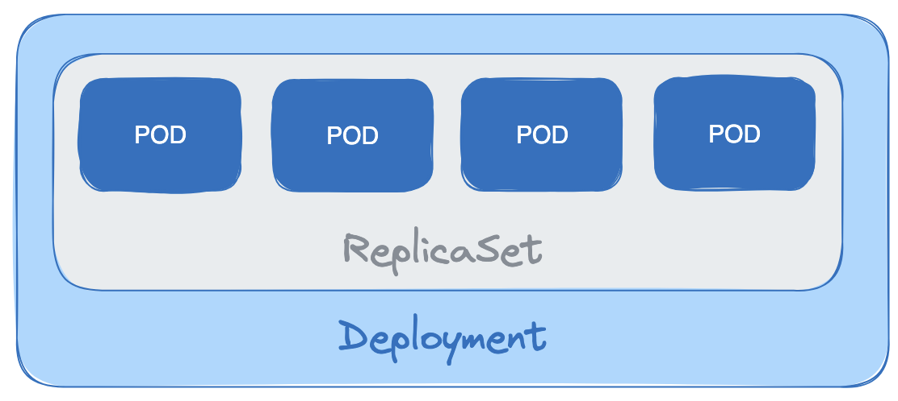

# Kubernetes: Objetos
O Kubernetes utiliza o conceito de objeto para designar um recurso do cluster. Esse objeto pode ser a representação de uma aplicação, uma configuração de rede, Load Balancer, etc. O objeto é descrito por meio de arquivos `yaml` que especificam o estado final desejado e uma vez executado o K8s vai trabalhar para garantir o estado desejado.

## POD
Corresponde a uma aplicação do cluster que pode ser composta de um ou mais containers. É o menor objeto que você pode criar no cluster.

> Por que deploys não gerenciam diretamente containers de forma individual? Às vezes um grupo de containers precisam ser escalonados juntos, executando no mesmo node e comunicando localmente, talvez compartilhando *storage* ou cache (por exemplo).


## Service
Pods são voláteis e o K8s não garante que eles estarão vivos para sempre. Dessa forma, o Service representa um grupo lógico de Pods e funciona como *gateway* de forma a permitir que outros pods mandem requests para o serviço sem ter que conhecer a rede dos Pods.

Um grupo de Pods apontado por um service é comumente determinado por um `label selector` (isso torna fácil apontar o serviço para um grupo de Pods diferentes durante um upgrade ou blue/green deploy).

## Volume
Storage. Aplicável a todo o pod e é montado em todos os containers do pod. Removido apenas quando o pod é destruído.

## Namespace
Cluster virtual. *Isolation of concerns*. **Recursos de um namespace não podem acessar recursos de outro namespace.**

## Deployment
Objeto que descreve o estado esperado de um Pod ou ReplicaSet. Deployments são criados, geralmente, através de arquivos de Manifesto (YAML).

```
⚠️ Atenção: réplicas gerenciadas através de um deployment não devem ser manipuladas diretamente, apenas por meio de um novo deployment.
```

## ReplicaSet (Controller)

Controlados pelo Deployment. Asseguram que o número de pods desejado para aquele deploy está rodando. Deployments não gerenciam Pods diretamente, esse trabalho é do ReplicaSet. Deployments, na verdade, gerenciam ReplicaSet e controlam como as réplicas se comportam quando atualizadas (lançando uma nova versão da aplicação, por exemplo). O Controller ReplicaSet vai dar start/stop em alguns pods para retificar a situação. Quando você atualiza o Deployment, um novo ReplicaSet é criado para gerenciar os Pods. Quando a atualização é finalizada, a replicaset antiga e seus pods são terminados.

OBS: A criação de um Deployment automaticamente cria um Replicaset.




## StatefulSet (Controller)

É um objeto responsável por gerenciar aplicações que são Stateful. Um Pod StatefulSet possui uma identidade única, uma identidade de rede estável e um storage estável ainda que haja reescalonamento do Pod para outro nó.

```
💡 Estável, aqui, refere-se a persistente ainda que haja rescheduling do pod para outro nó
```

O StatefulSet garante a **ORDEM** e **UNICIDADE** dos Pods, mantendo suas identidades. Considerações:

- StatefulSet permite dar start e stop em pods de acordo com uma sequência específica. Com Deployments você dá start e stop nos Pods de forma randômica e é OK isso ocorrer para serviços stateless (onde cada réplica é idêntica à outra).
- Às vezes queremos iniciar Pods em uma sequência numerada e estar apto a identificá-los pelo número (*e.g.* o Redis cria seu próprio cluster e precisa saber quem é o leader por um nome previsível).
- Cada réplica deve está rodando e pronta antes do k8s dar start na próxima e, da mesma forma, quando um StatefulSet é terminado, as réplicas serão terminadas na ordem reversa, esperando para cada Pod finalizar antes de ir para o próximo.
- StatefulSets são usados para Pods colaborativos: eles necessitam ser inicializados em uma ordem específica (*e.g.* replicas de BD).
- Para que possamos endereçar cada pod por um nome de DNS previsível (*e.g.* redis-1) você também precisa criar um **Service com ClusterIp de tipo None (conhecido como *headless service*)**.
    - Com isso, você tem uma entrada de DNS (*e.g.* redis) que faz LoadBalancing entre todos os Pods. Além disso, você tem um único nome DNS mas também tem entradas de DNS individuais para cada número do Pod (e.g. redis-0, redis-1, etc…)
    - Pods que precisarem entrar nesse cluster (de Redis, por exemplo) podem contactar redis-0 especificamente, mas aplicações que precisem do LB Redis Service podem usar o DNS para se comunicar randomicamente com um pod.
- StatefulSets também podem gerenciar armazenamento de disco para os Pods usando o **VolumeClaimTemplate** que automaticamente cria um **PersistentVolumeClaim**.

## DaemonSet

Garante que todos (ou alguns) nodes ativos estão rodando ao menos uma cópia do Pod. Dinamicamente aloca pods em nodes no momento que são criados e removidos.

Permite que seja executado um, e apenas um, agente em cada node. Muito útil para logs, por exemplo, onde queremos apenas 1 agente de logs por nó (e não por Pod senão teremos replicação de código desnecessariamente).

## Job

Executa um Pod por um número de vezes específico. Após isso, é considerado concluído.

- **Completions** determina o número de vezes que um Pod precisa executar com sucesso antes do Job ser considerado concluído. O valor default é 1, ou seja, o pod irá executar uma única vez.
- **Parallelism** especifica quantos pods devem rodar por vez. O valor default é 1, ou seja, apenas um Pod irá rodar por vez.

## Cronjobs

- **Spec.schedule** especifica quando o job irá rodar, usando o mesmo formato do cron no Unix.
- **Spec.jobTemplate** especifica o template para o Job que será executado, e é exatamente igual ao manifesto de um Job normal.

## Horizontal Pod Autoscalers

Permite que o Kubernetes ajuste o número de réplicas para você de forma automática em resposta a uma demanda.

- Fica observando as métricas do Deployment para ver se é necesário scale up ou down.
- Embora utilização de CPU é a métrica mais comum, você pode usar qualquer métrica disponível para Kubernetes, incluindo *system metrics* como CPU e uso de memória, e *service metrics* específicos do app (que você define e exporta da sua aplicação, como taxa de erro).

## PodPresets

Funcionalidade experimental no K8s que permite que você injete alguma informação nos Pods quando eles são criados (e.g. você poderia criar um PodPreset que monta o volume em todos os Pods que dão match em um grupo de labels). É considerado um tipo de objeto chamado *admission controller*. AC fazem watch em Pods que estão sendo criados e tomam alguma ação quando esses pods dão match com o seletor.

## Custom Resource Definitions

CRD permite que você crie seu próprio tipo de objeto para aplicações que precisam de um gerenciamento mais complicado. Alguns CRDs só existem para armazenar dados (*e.g.* Velero BackupStorageLocation) mas você pode ir além e criar objetos que agem como Pod controllers, apenas como um Deployment ou StatefulSet.

## Ingress

Recurso que gerencia o acesso externo aos serviços em um cluster. Ele fornece uma maneira de expor serviços HTTP e HTTPS para o tráfego externo, geralmente para roteamento com base em regras específicas.O Ingress recebe requests de clientes e envia para o Service que, então, envia para o Pod correto baseado no seletor. Você pode pensar no Ingress como um LB que fica na frente de um Serviço.

Por exemplo, o Ingress abaixo encaminha o tráfego para um Serviço de nome *demo-service* na porta 80.

```yaml
apiVersion: extensions/v1beta1
kind: Ingress
metadata:
    name: demo-ingress
spec:
    backend:
        serviceName: demo-service
        servicePort: 80
```

Enquanto que o Service roteia o tráfego interno do cluster, o Ingress Rule é útil para roteamento de tráfego externo para dentro do cluster e para o microsserviço apropriado.

```yaml
apiVersion: extensions/v1beta1
kind: Ingress
metadata:
    name: fanout-ingress
spec:
    rules:
    - http:
        paths:
        - path: /hello
          backend:
            serviceName: hello
            servicePort: 80
        - path: /goodbye
          backend:
            serviceName: goodbye
            servicePort: 80
```

LBs de alta disponibilidade podem ser caros. Então, fanout Ingress permite que você tenha 1 load balancer (e seus ingress associados) roteando o tráfego para um grande número de serviços. Você não está limitado ao roteamento baseado nas URLs. Você pode também usar HTTP Host header para que requisições para diferentes domínios sejam roteados para o Serviço apropriado.

Ingress podem lidar com conexões seguras usando TLS (antes conhecido como SSL). Se você tem muitos serviços diferentes e aplicações no mesmo domínio, todas elas podem compartilhar o mesmo certificado TLS e um único Ingress pode gerenciar essas conexões (conhecido como TLS termination).

Você pode automaticamente requisitar e renovar os certificados TLS usando o popular LetsEncrypt. Basta usar o cert-manager (http://docs.cert-manager.io/en/latest/). Se você executá-lo no seu cluster ele automaticamente vai detectar TLS Ingresses que não tenham certificados e requisitar um do provedor especificado (*e.g.* LetsEncrypt). *Cert-manager é mais moderno e o sucessor do kube-lego.*

A forma como as conexões TLS são tratadas depende do **Ingress Controller**. O ingress controller é responsável por gerenciar os recursos no seu cluster. Dependendo de onde você está rodando o cluster, o controller pode variar. Geralmente, customizar o comportamento do seu Ingress é feito ao adicionar annotations específicos que são reconhecidos pelo controller. GKE tem a opção do Compute LB e a AWS tem um produto similar chamado de Application Load Balancer. Esses serviços provêem um IP público onde o ingress vai fazer listening para requests.

Você também pode instalar e rodar seu próprio Ingres Controller dentro do cluster, ou mesmo executar múltiplos controllers se quiser. Algumas opções são: nginx-ingress, contour e traefik. A maioria dos serviços de k8s gerenciáveis provêm alguma forma de integração com um Cloud Load Balancer. Por exemplo, ao criar um serviço LB no GKE, ou Ingress, um Cloud LB é automaticamente criado e conectado ao seu serviço.
