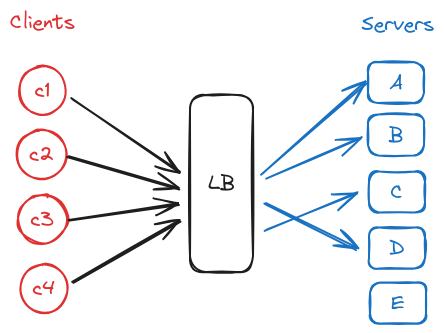
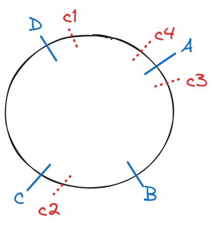
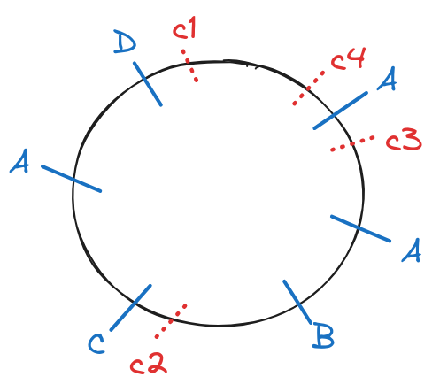

# Hashing
Ação que consiste em transformar um dado em um valor de tamanho fixo, geralmente um número inteiro. O dado pode ser qualquer coisa: endereço IP, username, HTTP Request, etc. **Uma boa função hash vai balancear os dados.**

Exemplo de caso de uso: fazer o hash do username de quem está fazendo a request e com a função MOD rotear a request para um servidor específico. Entao o mesmo usuário sempre vai bater no mesmo servidor. Esse servidor pode, então, implementar um cache em memória para otimizar a resposta.

No cenário abaixo estamos utilizando uma função hash para rotear as requests para os mesmos servidores com base no username do usuário e uma operação MOD.



Contudo, o que acontece se um dos servidores cair? Ou mesmo precisarmos adicionar mais servidores para lidar com a carga? Nesse cenário, Consistent Hashing e Rendezvous Hashing entram! Eles são estratégias de hashing que lidam com esse problema.

## Hashing Function
Função que aceita como entrada um dado e joga pra fora um número. Uma boa função tenta minimizar *hash collisions* (o que é equivalente a maximizar **uniformidade**).

## Consistent Hashing
Tipo de hash que minimiza o número de chaves que precisam ser remapeadas quando a hash table é redimensionada. É geralmente usado por LB para distribuir tráfego; minimiza o número de requisições que são redirecionadas para diferentes servidores quando novos servidores são adicionados ou quando servidores existentes são derrubados.

Posicionamos os servidores (A, B, C, D) em um modelo de anel (apenas para fins ilustrativos). Os hashes são calculados para os usuários (C1, C2, C3, C4) e os valores são colocados nos círculos. O círculo anda em sentido horário de forma que temos um marco 0 no topo e um valor máximo X. À medida que andamos no círculo nos aproximamos de X. As requisições ficam assim:

- C1 → A
- C4 → A
- C3 → B
- C2 → C



Se colocarmos um novo servidor (E) entre D e A, a requisição de C1 vai para o servidor E. Se removermos o servidor C, a requisição de C2 vai para o servidor D.

O ponto do algoritmo em questão é que ao adicionar ou remover um servidor mantemos a maioria dos mapeamentos entre clientes e servidores. Apenas alguns (poucos) mapeamentos mudam. Por isso Consistent Hashing é tão poderoso: ele mantem algum nível de consistência entre os hashes e os buckets alvo.

Esse algoritmo também permite ajustar o círculo para balancear melhor os direcionamentos. Supomos que a função hash está colocando muito mais requests do lado direito do círculo e com isso o servidor D é menos utilizado que os demais. Você quer distribuir o tráfego de uma forma ainda mais uniforme, então você pode passar os servidores por múltiplas funções hash e colocar esses hashes no círculo de forma que um servidor vai estar em mais de uma parte do círculo.

Outro cenário: servidor A é o mais parrudo de todos e você quer uma distribuição que considere ele um pouco mais. Você pode passar uma nova função hash apenas nele para que ele esteja em mais partes do círculo do que os demais. Vide imagem abaixo:



## Rendezvous Hashing
Tipo de hash também chamado de *Highest Random Weight* hashing. Permite re-distribuição mínima de mapeamentos quando um server cai.

Exemplo de uso: Para cada username vamos calcular um score e criar um ranking de score para os servidores de destino. Por exemplo, calculamos o score do username0 e todos os scores dos servidores disponíveis. Rankeamos os valores dos servidores e digamos que o servidor com maior ranking seja o server0, então a request será direcionada para ele. Se removermos o server5 do ranking, não haverá side effects. Se removermos o server0 temos que olhar para o servidor com maior ranking, que pode ser o server1.

```jsx
const serverSet = [
	'server0',
	'server1',
	'server2',
	'server3',
	'server4',
	'server5',
]

const usernames = [
	'username0',
	'username1',
	'username2',
	'username3',
	'username4',
	'username5',
	'username6',
	'username7',
	'username8',
	'username9',
]

// Naïve approach
function pickServerSimple(username, servers) {
	const hash = hashString(username);
	const servers[hash % servers.length];
}

// Rendezvous approach
function pickServerRendezvous(username, servers) {
	let maxServer = null;
	let maxScore = null;
	for (const server of servers) {
		const score = computeScore(username, server);
		if (maxScore === null || score > maxScore) {
			maxScore = score;
			maxServer = server;
		}
	}
	return maxServer;
}

// provavelmente você nunca vai ter que escrever
// uma função de hash. 
function hashString(string) {
	let hash = 0;
	if (string.length === 0) return hash;
	for (let i= 0; i < string.length; i++) {
		charcCode = string.charCodeAt(i);
		hash = (hash << 5) - hash + charCode;
		hash |= 0;
	}
	return hash;
}

function computeScore(username, server) {
	const usernameHash = hashString(username);
	const serverHash = hashString(server);

  // chegamos nessa linha por tentativa e erro
  // para chegar numa distribuição uniforme
  // mas você vai usar algum algoritmo ja validado
  // pela indústria
	return (usernameHash + 13 + serverHash * 11) % 67;
}

// Aqui tem pouco (ou nenhum) equal == true
// o que indica que a remoção de um servidor desbalanceou bastante
console.log('Simple Hashing Strategy:');
for (const username of usernames) {
	const server1 = pickServerSimple(username, serverSet1);
	const server2 = pickServerSimple(username, serverSet2);
	const serversAreEqual = server1 === server2;
	console.log(`${username}: ${server1} => ${server2} | equal: ${server1 == server2}`);
}

// Aqui tem muito equal == true
// o que indica que a remoção de um servidor não desbalanceou
// tanto o algoritmo
console.log('Rendezvous Hashing Strategy:');
for (const username of usernames) {
	const server1 = pickServerRendezvous(username, serverSet1);
	const server2 = pickServerRendezvous(username, serverSet2);
	const serversAreEqual = server1 === server2;
	console.log(`${username}: ${server1} => ${server2} | equal: ${server1 == server2}`);
}
```

O algoritmo acima em grande escala é muito útil. Imagine a quantidade de hit miss que daria na Amazon ao usar Simple Hashing Strategy caso um servidor caísse. São milhões e reais.

## Hot Spot
Ao distribuir uma carga entre os servidores ela pode acabar sendo distribuída de forma desigual. Isso pode acontecer se a *sharding key* ou a *hashing function* não forem ótimas ou se sua carga é naturalmente desbalanceada. Alguns servidores vão receber muito mais tráfego do que outros, criando assim um *hot spot*.