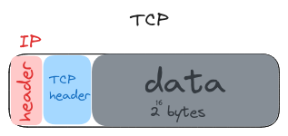

# Rede
Uma rede de computadores refere-se a um conjunto de dispositivos interconectados que podem se comunicar entre si e compartilhar recursos. Esses dispositivos podem incluir computadores, servidores, roteadores, switches, entre outros.

## Endereço IP
Endereço dado a uma máquina que está conectada na internet pública. IPV4 consistem em 4 números separados por números (**a.b.c.d**) entre 0 e 255. Casos especiais incluem **127.0.0.1** que é sua máquina local (localhost) e **192.168.x.y** que corresponde a sua rede privada.

O IP (internet Protocol) desenha como todas as comunicações máquina-máquina devem acontecer ao redor do mundo. Protocolos como TCP, UDP e HTTP são construídos em cima do IP.

## DNS (Domain Name System)
Descreve entidades e protocolos envolvidos na tradução de nomes de domínio para endereços IP.

## TCP
**Protocolo de rede** construído em cima do IP e que permite entrega ordenada e confiável de dados entre máquinas conectadas na internet. TCP adiciona um TCP header dentro pacote IP para garantir a entrega. Geralmente TCP é implementado no kernel e expõe **sockets** para aplicações que desejam fazer streaming de dados via conexão aberta.

## HTTP (HyperText Transfer Protocol)
**Protocolo de rede** comum construído em cima do TCP para troca de texto cliente-servidor. Implementa o paradigma request/response. IP e TCP são protocolos bem utilizados para transporte de dados enquanto que o HTTP traz a possibilidade de adicionar uma camada de regras de negócio por meio da exposição de rotas que podem receber dados/headers/etc.

## IP Packet
Também chamado genericamente de pacote de rede, corresponde a menor unidade usada para descrever dados enviados por IP. Consiste em um cabeçalho (que contém endereços de IP de origem e destino e metadados) e um payload (2^16 bytes) (que é o dado sendo enviado pela rede).

## Porta
Número inteiro entre 0 e 65535 (2^16 portas) que permite programas escutarem novas conexões de rede na mesma máquina sem colidir. Algumas portas são reservadas ao sistema (0-1023) e são bem conhecidas (22 secure shell, 53 DNS lookup, 80 HTTP, 443 HTTPS).
